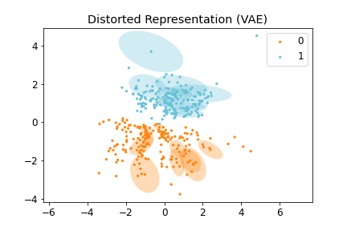
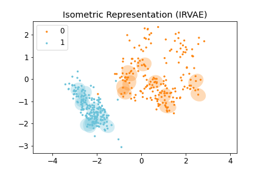
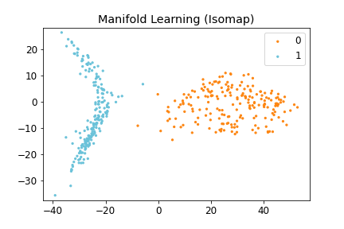
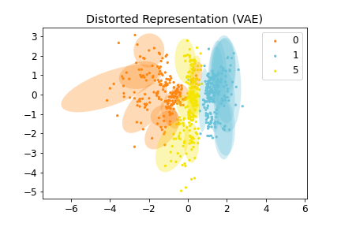
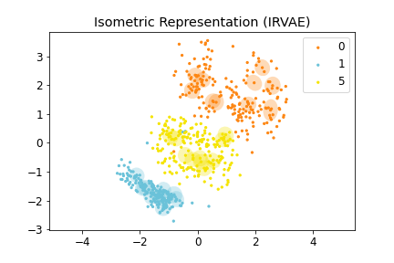
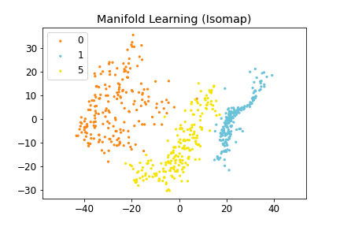
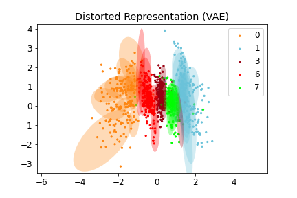
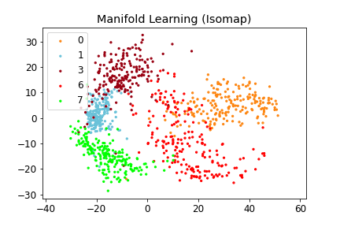
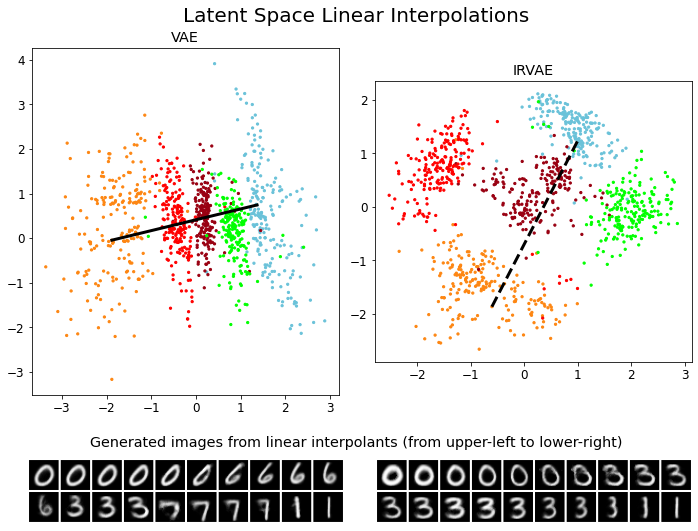
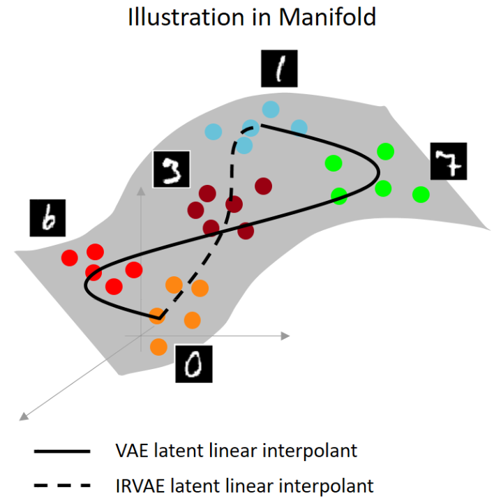

# Regularized Autoencoders for Isometric Representation Learning
The official repository for \<Regularized Autoencoders for Isometric Representation Learning\> (Lee, Yoon, Son, and Park, ICLR 2022).

> This paper proposes Isometrically Regularized Variational Autoencoders (IRVAE), a regularized autoencoder trained by minimizing the *VAE loss function + relaxed distortion measure*. It produces isometric representation where Euclidean distances approximate geodesic distances in the learned manifold.

- *Paper*  
- *[5-mins video](https://youtu.be/5bxwtsC6bIE)*  
- *[5-mins Slides](https://drive.google.com/file/d/1F1ZzdEjkVc3_UkQxOKxCu6MGDH-y924G/view?usp=sharing)*  
- *[15-mins Slides](https://drive.google.com/file/d/1BUaGmK5rUNhWAPOVQ7BvlC3WpKsFM9-z/view?usp=sharing)*  
- *[Poster](https://drive.google.com/file/d/1Zh3QlURKBN5IV8Rrkjva87-D1567g4Hi/view?usp=sharing)*  
- *[OpenReview](https://openreview.net/forum?id=mQxt8l7JL04)*  

## Coordinate-Invariant Relaxed Distortion Measure
```python
def relaxed_distortion_measure(func, z, eta=0.2, create_graph=True):
    '''
    func: decoder that maps "latent value z" to "data", where z.size() == (batch_size, latent_dim)
    '''
    bs = len(z)
    z_perm = z[torch.randperm(bs)]
    alpha = (torch.rand(bs) * (1 + 2*eta) - eta).unsqueeze(1).to(z)
    z_augmented = alpha*z + (1-alpha)*z_perm
    v = torch.randn(z.size()).to(z)
    Jv = torch.autograd.functional.jvp(
        func, z_augmented, v=v, create_graph=create_graph)[1]
    TrG = torch.sum(Jv.view(bs, -1)**2, dim=1).mean()
    JTJv = (torch.autograd.functional.vjp(
        func, z_augmented, v=Jv, create_graph=create_graph)[1]).view(bs, -1)
    TrG2 = torch.sum(JTJv**2, dim=1).mean()
    return TrG2/TrG**2
```
- To implement the __relaxed distortion measure__ for your decoder or generator function, you can simply copy and paste the above code block. 

## Preview (MNIST)
### 1. MNIST images of digits 0 and 1
<center>
<div class="imgCollage">
<span style="width: 31.8%"></span>
<span style="width: 31.8%"> </span>
<span style="width: 31.8%"> </span>
</div>
  <I>Figure 1: <b>(Left)</b> Distorted Representation obtained by VAE, <b>(Middle)</b> Isometric Representation obtained by IRVAE, and <b>(Right)</b> Isometric Embedding obtained by Isomap (non-parametric manifold learning approach). Ellipses represent pullbacked Riemannian metrics; the more isotropic and homogeneous, the more isometric. </I>
</center>
<br>

### 2. MNIST images of digits 0, 1, and 5
<center>
<div class="imgCollage">
<span style="width: 31.8%"></span>
<span style="width: 31.8%"> </span>
<span style="width: 31.8%"> </span>
</div>
  <I>Figure 2: <b>(Left)</b> Distorted Representation obtained by VAE, <b>(Middle)</b> Isometric Representation obtained by IRVAE, and <b>(Right)</b> Isometric Embedding obtained by Isomap (non-parametric manifold learning approach). Ellipses represent pullbacked Riemannian metrics; the more isotropic and homogeneous, the more isometric. </I>
</center>
<br>

### 3. MNIST images of digits 0, 1, 3, 6, and 7
<center>
<div class="imgCollage">
<span style="width: 31.8%"></span>
<span style="width: 31.8%"> </span>
<span style="width: 31.8%"> </span>
</div>
  <I>Figure 3-1: <b>(Left)</b> Distorted Representation obtained by VAE, <b>(Middle)</b> Isometric Representation obtained by IRVAE, and <b>(Right)</b> Isometric Embedding obtained by Isomap (non-parametric manifold learning approach). Ellipses represent pullbacked Riemannian metrics; the more isotropic and homogeneous, the more isometric. </I>
</center>
<br>
<br>
<center>
<div class="imgCollage">
<span style="width: 50%"></span>
<span style="width: 50%"> </span>
</div>
  <I>Figure 3-2: Latent Space Linear Interpolations and Generated Images in VAE and IRVAE. </I>
</center>
<br>

## Environment

The project is developed under a standard PyTorch environment.
- python 3.8.8
- numpy
- matplotlib
- argparse
- yaml
- omegaconf
- torch 1.8.0
- CUDA 11.1
- tensorboard

## Running
### 1. Train
#### 1.1 VAE
```js
python train.py --config configs/mnist_vae_z2.yml --run vae_mnist_{digits} --data.training.digits list_{digits} --data.validation.digits list_{digits} --device 0 
```
#### 1.2 IRVAE
```js
python train.py --config configs/mnist_irvae_z2.yml --run irvae_mnist_{digits} --data.training.digits list_{digits} --data.validation.digits list_{digits} --model.iso_reg 1000 --device 0 
```
- If you want the training dataset to include MNIST digits 0, 1, and 2, you should set `digits` as `012`. For example, `digits` can be `01`, `015`, or `24789`. 
- The result will be saved in './results' directory.  

### 2. Tensorboard 
```js
tensorboard --logdir results/
```
* __Scalars__: loss/train_loss_ (training loss function), loss/val_loss_ (reconstruction error), iso_loss_ (isometric regularization term), MCN_ (mean condition number)

* __Images__: input_ (input image), recon_ (reconstructed image), latent_space_ (latent space embeddings with equidistant ellipses)


### 3. Notebook
- In 'notebook/1. MNIST_results.ipyng', you can find the figure generation code.

## Citation
If you found this library useful in your research, please consider citing:
```
@article{lee2022isometric,
  title={Regularized Autoencoders for Isometric Representation Learning},
  author={Lee, Yonghyeon and Yoon, Sangwoong and Son, Minjun and Park, Frank},
  journal={International Conference on Learning Representations},
  year={2022}
}
```
